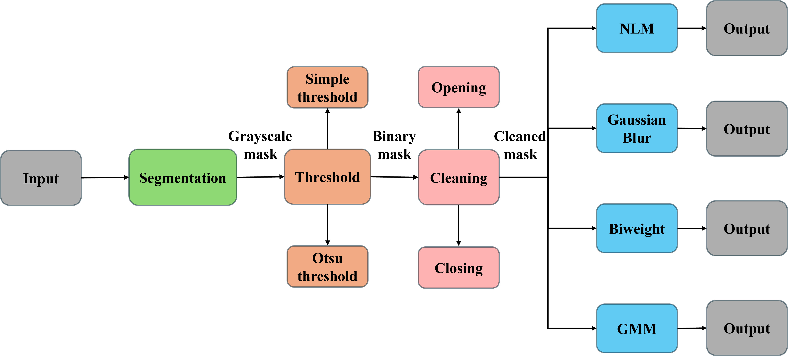
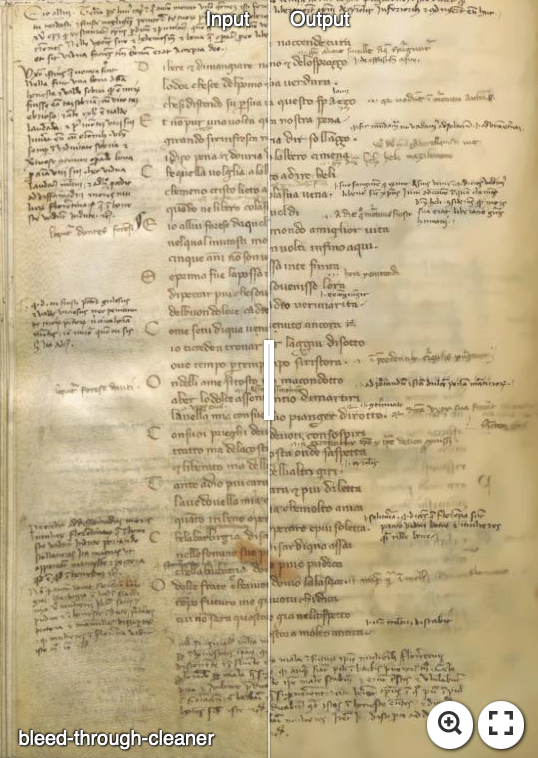

# Bleed-through-cleaner

Ancient manuscripts suffer from aging problems, due to chemical agents, humidity and other factors, all of which tend to diminish the document readability. One of the most invalidating effect of aging is bleed-through, which is the phenomenon of ink from one side of the paper seeping through to the other side. 

Our bleed-through minimization approach works without the alignment technique (no registration of the pages). It is based on the segmentation of different components within a page, with a further denoising algorithm to detect and reject the bleed-through presence, preserving all the rest.

In the following figure it is shown a diagram of the main steps of our approach.

The following image shows on the left side the original page and on the right side the cleaned page. The bleed-through is removed and the text is preserved.
Click on it so that you can move the slider to better appreciate the results.

## Documentation
This work has been published in the open access journal [Journal of Imaging](https://www.mdpi.com/journal/jimaging ). You may access the paper from the following link [Paper](https://www.mdpi.com/2313-433X/11/5/136).

## Contact
If you have any questions, feel free to contact me at `adriano.ettari@unina.it` or on my LinkedIn page 
