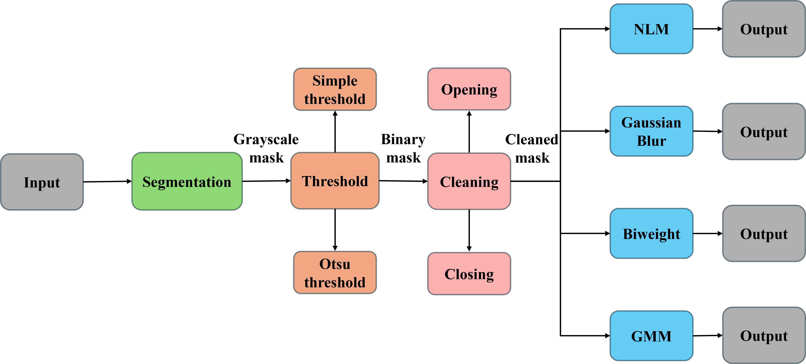

# Bleed-through-cleaner

<!-- Paper:  -->

Ancient manuscripts suffer from aging problems, due to chemical agents, humidity and other factors, all of which tend to diminish the document readability. One of the most invalidating effect of aging is bleed-through, which is the phenomenon of ink from one side of the paper seeping through to the other side. 

Our bleed-through minimization approach works without the alignment technique (no registration of the pages). It is based on the segmentation of different components within a page, with a further denoising algorithm to detect and reject the bleed-through presence, preserving all the rest.




## RESULTS

### 

[](https://imgsli.com/Mjc2NjAw)

Here is a 25 seconds video showcasing the denoising process for the super resolution problem of the Sentinel-2 dataset:


### IMAGE GENERATION of https://github.com/phelber/EuroSAT. 
The first set of images is the real one and the second set is the generated one.


## Train (snippet to train a)
```
```

## Contact
If you have any questions, feel free to contact me at `adriano.ettari@unina.it` or on my LinkedIn page [](https://www.linkedin.com/in/adriano-ettari-b8741b21b/)
